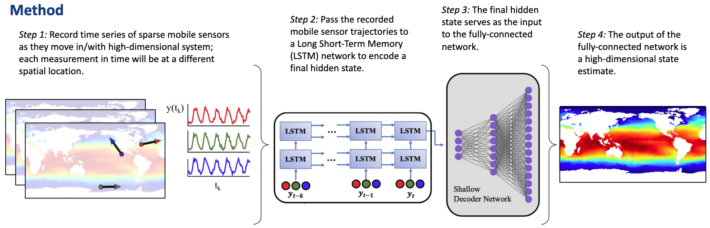

## Mobile sensing with SHallow REcurrent Decoders (SHRED)

Sensing is a fundamental task for the monitoring, forecasting, and control of complex systems. In many applications, a limited number of sensors are available and must move with the dynamics. Currently, optimal path planning, like Kalman filter estimation, is required to enable sparse mobile sensing for state estimation. However, we show that arbitrary mobile sensor trajectories can be used. By adapting the Shallow REcurrent Decoder (SHRED) network with mobile sensors, their time-history can be used to encode global information of the measured high-dimensional state space.

### Goal
Leverage sparse mobile sensor trajectories for full-state estimation, agnostic to sensor path

### Technique
Provide dynamical trajectories to a recurrent neural network to encode global information of the measured high-dimensional space

### Papers
[Williams, J. P., Zahn, O., & Kutz, J. N. (2023). Sensing with shallow recurrent decoder networks. arXiv preprint arXiv:2301.12011.](https://arxiv.org/pdf/2301.12011.pdf)

[Ebers, M. R., Williams, J. P., Steele, K. M., & Kutz, J. N. (2023). Leveraging arbitrary mobile sensor trajectories with shallow recurrent decoder networks for full-state reconstruction. arXiv preprint arXiv:2307.11793.](https://arxiv.org/pdf/2307.11793.pdf)